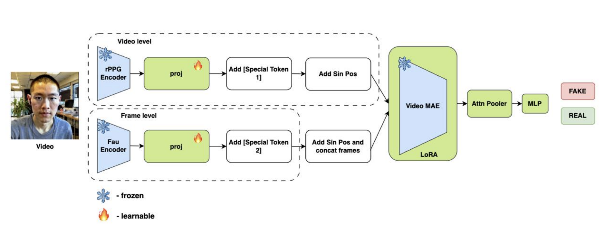

# deepfake-multimodal-recognition

Мультимодальный детектор дипфейков на основе физиологических (rPPG) и мимических (FAU) признаков.

[English](#english) | [Русский](#русский)

---

## English

Research repository for **multimodal deepfake detection**. The model jointly leverages:

- **FAU branch** — frame-level facial action unit features (Swin Transformer Tiny + MEGraphAU GNN)
- **rPPG branch** — video-level physiological features (PhysNet, blood volume pulse signal)
- **Q-Former fusion** — Transformer Decoder with 32 learnable queries cross-attends to both modalities
- **Attention Pooler + MLP head** — binary classification (REAL / FAKE)
- **Optional multi-task heads** — auxiliary classifiers for gender, ethnicity, and emotion

## Architecture



See [docs/architecture.md](docs/architecture.md) for a detailed component description.

The model processes a video clip `[B, 3, T, H, W]` through two parallel branches:

1. **FAU branch (frame-level).** Each frame is passed through the frozen (or fine-tuned) MEGraphAU encoder (Swin-T backbone + GNN). The raw `[B·T, N_AU, D]` features are projected to `embed_dim`, then positional encoding is applied **per AU** — each of the 12 AUs gets its own temporal trajectory. A segment embedding `0` marks all FAU tokens.

2. **rPPG branch (video-level).** The full clip is passed through PhysNet, producing a per-frame feature sequence `[B, T, D_phys]`. Features are projected to `embed_dim`, sinusoidal positional encoding is added, and segment embedding `1` marks all rPPG tokens.

Both token sequences are concatenated and used as **memory** in a 6-layer Transformer Decoder. A set of 32 learnable query embeddings cross-attends to this memory. The decoded queries are aggregated by a 2-layer Attention Pooler (softmax-weighted sum), then passed through LayerNorm + Dropout to the binary classifier.

When multi-task heads are enabled (`num_gender/ethnicity/emotion_classes > 0`), the pooled feature also feeds into separate linear heads, and task weights are balanced via **uncertainty weighting** (Kendall et al. 2018).

### Model parameters

| Parameter | Default |
|---|---|
| FAU backbone | Swin Transformer Tiny |
| rPPG backbone | PhysNet |
| Input frames | 32 |
| Embedding dim | 512 |
| Num queries | 32 |
| Decoder layers | 6 |
| Attention heads | 8 |
| Dropout | 0.3 |
| Num AU classes | 12 |

## Datasets

Trained and evaluated on three public deepfake datasets:

| Dataset | Description |
|---|---|
| **FF++** (FaceForensics++) | Face-swapped videos, multiple manipulation methods |
| **CelebDF** (Celeb-DeepFake) | High-quality celebrity deepfake videos |
| **VCDF-X** | AI-generated face content |

Data split: KMeans cluster split (k=3) on face crop color histograms — train/val/test clusters are assigned by maximum centroid distance.

## Ablation Study — Cross-Dataset Evaluation

Models trained on one dataset and evaluated on all three. Metrics on the val split (seed=42).

### Accuracy

| Train \ Test | FF++ | CelebDF | VCDF-X |
|---|:---:|:---:|:---:|
| **FF++** | **0.8316** | 0.7616 | 0.5479 |
| **CelebDF** | 0.6464 | **0.9342** | 0.4944 |
| **VCDF-X** | 0.4842 | 0.4875 | **0.9269** |
| **Mix (all)** | 0.8057 | **0.9728** | **0.9131** |

### F1 (macro)

| Train \ Test | FF++ | CelebDF | VCDF-X |
|---|:---:|:---:|:---:|
| **FF++** | **0.8622** | 0.7320 | 0.5489 |
| **CelebDF** | 0.3914 | **0.9602** | 0.2585 |
| **VCDF-X** | 0.3140 | 0.1692 | **0.9055** |
| **Mix (all)** | 0.8077 | **0.9809** | **0.9073** |

### AUROC

| Train \ Test | FF++ | CelebDF | VCDF-X |
|---|:---:|:---:|:---:|
| **FF++** | **0.9758** | 0.8166 | 0.5768 |
| **CelebDF** | 0.7538 | **0.9999** | 0.3458 |
| **VCDF-X** | 0.4497 | 0.5445 | **0.9799** |
| **Mix (all)** | 0.9351 | **0.9981** | **0.9752** |

### Observations

- Each single-dataset model achieves strong in-domain performance (0.83–0.93 accuracy).
- Cross-domain generalization is poor for single-dataset models — VCDF-X and CelebDF artifacts differ significantly from FF++.
- **Mix training** (FF++ + CelebDF + VCDF-X) achieves the best overall generalization: 0.81 / 0.97 / 0.91 accuracy and 0.94 / 0.998 / 0.975 AUROC.

<details>
<summary>Full per-experiment metrics</summary>

**FF++ → FF++**

| Metric | Value |
|---|---:|
| Loss | 0.1478 |
| Accuracy | 0.8316 |
| F1 (macro) | 0.8622 |
| Precision | 0.9033 |
| Recall | 0.8316 |
| AUROC | 0.9758 |

Per-class: crop_img acc=0.9807, f1=0.9634 | real acc=0.6825, f1=0.7611

**FF++ → CelebDF**

| Metric | Value |
|---|---:|
| Loss | 0.3493 |
| Accuracy | 0.7616 |
| F1 (macro) | 0.7320 |
| Precision | 0.7116 |
| Recall | 0.7616 |
| AUROC | 0.8166 |

Per-class: crop_img acc=0.9049, f1=0.9238 | real acc=0.6184, f1=0.5402

**FF++ → VCDF-X**

| Metric | Value |
|---|---:|
| Loss | 1.2221 |
| Accuracy | 0.5479 |
| F1 (macro) | 0.5489 |
| Precision | 0.5540 |
| Recall | 0.5479 |
| AUROC | 0.5768 |

Per-class: fake acc=0.7828, f1=0.7551 | real acc=0.3130, f1=0.3427

**CelebDF → CelebDF**

| Metric | Value |
|---|---:|
| Loss | 0.0446 |
| Accuracy | 0.9342 |
| F1 (macro) | 0.9602 |
| Precision | 0.9908 |
| Recall | 0.9342 |
| AUROC | 0.9999 |

Per-class: crop_img acc=1.0000, f1=0.9908 | real acc=0.8684, f1=0.9296

**CelebDF → FF++**

| Metric | Value |
|---|---:|
| Loss | 3.2892 |
| Accuracy | 0.6464 |
| F1 (macro) | 0.3914 |
| Precision | 0.5987 |
| Recall | 0.6464 |
| AUROC | 0.7538 |

Per-class: crop_img acc=0.2928, f1=0.4530 | real acc=1.0000, f1=0.3298

**CelebDF → VCDF-X**

| Metric | Value |
|---|---:|
| Loss | 3.8568 |
| Accuracy | 0.4944 |
| F1 (macro) | 0.2585 |
| Precision | 0.4681 |
| Recall | 0.4944 |
| AUROC | 0.3458 |

Per-class: fake acc=0.0352, f1=0.0667 | real acc=0.9535, f1=0.4503

**VCDF-X → VCDF-X**

| Metric | Value |
|---|---:|
| Loss | 0.2047 |
| Accuracy | 0.9269 |
| F1 (macro) | 0.9055 |
| Precision | 0.8915 |
| Recall | 0.9269 |
| AUROC | 0.9799 |

Per-class: fake acc=0.9028, f1=0.9387 | real acc=0.9511, f1=0.8722

**VCDF-X → FF++**

| Metric | Value |
|---|---:|
| Loss | 2.3390 |
| Accuracy | 0.4842 |
| F1 (macro) | 0.3140 |
| Precision | 0.4896 |
| Recall | 0.4842 |
| AUROC | 0.4497 |

Per-class: crop_img acc=0.2541, f1=0.3898 | real acc=0.7143, f1=0.2381

**VCDF-X → CelebDF**

| Metric | Value |
|---|---:|
| Loss | 2.7093 |
| Accuracy | 0.4875 |
| F1 (macro) | 0.1692 |
| Precision | 0.4792 |
| Recall | 0.4875 |
| AUROC | 0.5445 |

Per-class: crop_img acc=0.0672, f1=0.1244 | real acc=0.9079, f1=0.2140

**Mix → FF++**

| Metric | Value |
|---|---:|
| Loss | 0.2222 |
| Accuracy | 0.8057 |
| F1 (macro) | 0.8077 |
| Precision | 0.8098 |
| Recall | 0.8057 |
| AUROC | 0.9351 |

Per-class: crop_img acc=0.9448, f1=0.9434 | real acc=0.6667, f1=0.6720

**Mix → CelebDF**

| Metric | Value |
|---|---:|
| Loss | 0.0368 |
| Accuracy | 0.9728 |
| F1 (macro) | 0.9809 |
| Precision | 0.9894 |
| Recall | 0.9728 |
| AUROC | 0.9981 |

Per-class: crop_img acc=0.9981, f1=0.9953 | real acc=0.9474, f1=0.9664

**Mix → VCDF-X**

| Metric | Value |
|---|---:|
| Loss | 0.1849 |
| Accuracy | 0.9131 |
| F1 (macro) | 0.9073 |
| Precision | 0.9022 |
| Recall | 0.9131 |
| AUROC | 0.9752 |

Per-class: fake acc=0.9338, f1=0.9436 | real acc=0.8924, f1=0.8711

</details>

## Repository structure

```
src/
  models/
    rppg_p_fau.py           # DeepfakeDetector — main model
    rppg_p_fau_lightning.py # FauRPPGDeepFakeRecognizer — Lightning module (multi-task)
    fau_classifier.py       # FAU-only classifier
    fau_lightning.py        # FAU-only Lightning module
    rppg_classifier.py      # rPPG-only classifier
    rppg_lightning.py       # rPPG-only Lightning module
  backbones/
    fau_encoder.py          # FAUEncoder — wraps MEGraphAU (MEFARG)
    rppg_encoder.py         # RPPGEncoder — wraps PhysNet
    pos.py                  # Sinusoidal positional encoding
    av_former.py            # AVFormer utilities
    MEGraphAU/              # ME-GraphAU submodule (Swin + GNN for AU detection)
    rPPGToolbox/            # rPPG-Toolbox submodule (PhysNet and others)
  data/
    dataset.py              # VideoFolderDataset — folder-based loading
    meta_dataset.py         # MetaVideoDataset — CSV-based multi-task loading
    transforms.py           # VideoTransform — consistent frame-level augmentations
    processor.py            # FaceDetector (MTCNN) + Processor pipeline
    split.py                # KMeans cluster-based train/val/test split
  pooler/
    attn_pooler.py          # AttentionPooler — softmax-weighted aggregation
    base_pooler.py
  loss/
    contrastive.py          # InfoNCEConsistencyLoss
  experiments/
    base_config.yml         # Standard config (no aux heads)
    meta_config.yml         # Multi-task config (gender=2, ethnicity=5, emotion=8)
    fau_config.yml          # FAU-only training config
    rppg_config.yml         # rPPG-only training config
  train.py                  # Main training entrypoint
  train_fau.py              # FAU-only training
  train_rppg.py             # rPPG-only training
  eval.py                   # GradCAM / feature visualization
evaluate.py                 # Evaluation entrypoint (all three dataset modes)
env.sh                      # Interactive weight downloader
load.py                     # Weight download helpers
docs/
  architecture.md           # Detailed architecture description
  architecture.drawio       # Architecture diagram source
  architecture.png          # Architecture diagram
  val_*.png                 # Validation metric plots
```

## Setup

### 1. Install dependencies

```bash
uv sync
```

Or with pip:

```bash
pip install -e .
```

### 2. Download pretrained weights

Interactive script to download FAU and backbone weights:

```bash
bash env.sh
```

Place FAU weights at:
```
src/backbones/MEGraphAU/checkpoints/MEFARG_swin_tiny_BP4D_fold1.pth
```

Place rPPG weights (from [rPPG-Toolbox](https://github.com/ubicomplab/rPPG-Toolbox)) at:
```
src/backbones/rPPGToolbox/final_model_release/PURE_PhysNet_DiffNormalized.pth
```

### 3. Configure environment

```bash
cp .env.example .env  # set EXPERIMENTS_CFG_FOLDER if needed
```

## Training

Training is implemented in **PyTorch Lightning** with DDP support.

### Mode 1 — folder-based datasets

Dataset structure: `root/class_name/video.mp4` (subdirectory name = class label).

```bash
python src/train.py -c src/experiments/base_config.yml \
    -d /path/to/ff++ \
    -d /path/to/celebdf
```

With a separate val/test dataset:

```bash
python src/train.py -c src/experiments/base_config.yml \
    -d /path/to/train_dataset \
    -vd /path/to/val_dataset
```

### Mode 2 — CSV-based multi-task datasets

CSV columns: `filename`, `target` (fake/real), `gender`, `ethnicity`, `emotion`.  
Use `meta_config.yml` to enable auxiliary heads.

```bash
python src/train.py -c src/experiments/meta_config.yml \
    -mc train_meta_v5.csv \
    --root_dir /path/to/videos
```

### Resume from checkpoint

```bash
python src/train.py -c src/experiments/base_config.yml \
    -d /path/to/dataset \
    -r checkpoints/last.ckpt
```

### FAU-only or rPPG-only training

```bash
python src/train_fau.py -c src/experiments/fau_config.yml -d /path/to/dataset
python src/train_rppg.py -c src/experiments/rppg_config.yml -d /path/to/dataset
```

### Key training parameters

| Parameter | Value |
|---|---|
| Optimizer | AdamW |
| Main LR | 1e-4 |
| Encoder LR | 1e-5 (when `full_train=true`) |
| Weight decay | 0.05 |
| Scheduler | CosineAnnealingLR (T_max=100) |
| Early stopping | val_auc, patience=15 |
| Grad accumulation | 2 batches |
| Max epochs | 1000 |
| Checkpointing | best val_auc, last |

## Evaluation

```bash
python evaluate.py -c src/experiments/base_config.yml \
    -ckpt checkpoints/best.ckpt \
    -ed /path/to/test_dataset
```

Three evaluation modes:

| Flag | Mode |
|---|---|
| `-d /path` | Reproduce cluster split from training, evaluate on `--split val\|test` |
| `-ed /path` | Evaluate the full dataset directly (no split) |
| `-mc meta.csv` | Evaluate from a CSV file |

Save results to JSON:

```bash
python evaluate.py ... -o results.json
```

## Notes

- This is a **research codebase**, not a production package.
- Pretrained backbone weights are required for reproducible results.
- Architecture diagram source: `docs/architecture.drawio`.
- The cluster split is deterministic (seed=42) but depends on video content — re-splitting on a new machine may differ if video decoding differs.

## Citation

If you use this repository, please cite the project page or contact the author directly.

---

## Русский

Исследовательский репозиторий для **мультимодальной детекции дипфейков**. Модель совместно использует:

- **FAU-ветка** — признаки единиц действия лица на уровне кадров (Swin Transformer Tiny + MEGraphAU GNN)
- **rPPG-ветка** — физиологические признаки на уровне видео (PhysNet, сигнал объёмного пульса крови)
- **Q-Former слияние** — Transformer Decoder с 32 обучаемыми запросами, выполняющий кросс-внимание к обеим модальностям
- **Attention Pooler + MLP** — бинарная классификация (REAL / FAKE)
- **Опциональные мультизадачные головы** — вспомогательные классификаторы пола, этничности и эмоций

## Архитектура


Подробное описание компонентов: [docs/architecture.md](docs/architecture.md).

Модель обрабатывает видеоклип `[B, 3, T, H, W]` через две параллельные ветки:

1. **FAU-ветка (уровень кадров).** Каждый кадр пропускается через MEGraphAU (Swin-T + GNN). Признаки проецируются в `embed_dim`, после чего применяется позиционное кодирование **по каждому AU** отдельно — каждый из 12 AU получает собственную временну́ю траекторию. Сегментное вложение `0` помечает FAU-токены.

2. **rPPG-ветка (уровень видео).** Весь клип подаётся в PhysNet, выдающий последовательность признаков `[B, T, D_phys]`. Признаки проецируются в `embed_dim`, добавляется синусоидальное позиционное кодирование, сегментное вложение `1` помечает rPPG-токены.

Обе последовательности токенов конкатенируются и подаются как **memory** в 6-слойный Transformer Decoder. 32 обучаемых запроса выполняют кросс-внимание к этой памяти. Декодированные запросы агрегируются Attention Pooler (softmax-взвешенная сумма), затем проходят через LayerNorm + Dropout в бинарный классификатор.

При включённых мультизадачных головах (`num_gender/ethnicity/emotion_classes > 0`) агрегированный признак дополнительно подаётся в отдельные линейные головы, веса задач балансируются через **uncertainty weighting** (Kendall et al. 2018).

## Датасеты

Обучение и оценка на трёх публичных датасетах:

| Датасет | Описание |
|---|---|
| **FF++** (FaceForensics++) | Face-swap видео с несколькими методами манипуляции |
| **CelebDF** (Celeb-DeepFake) | Высококачественные дипфейки знаменитостей |
| **VCDF-X** | AI-генерированный контент с лицами |

Разбиение: KMeans cluster split (k=3) по цветовым гистограммам кропов лица — train/val/test кластеры определяются максимальным расстоянием между центроидами.

## Ablation Study — Кросс-датасетная оценка

Модели обучены на одном датасете и протестированы на всех трёх. Метрики на val split (seed=42).

### Accuracy

| Обучение \ Тест | FF++ | CelebDF | VCDF-X |
|---|:---:|:---:|:---:|
| **FF++** | **0.8316** | 0.7616 | 0.5479 |
| **CelebDF** | 0.6464 | **0.9342** | 0.4944 |
| **VCDF-X** | 0.4842 | 0.4875 | **0.9269** |
| **Смесь (все)** | 0.8057 | **0.9728** | **0.9131** |

### F1 (macro)

| Обучение \ Тест | FF++ | CelebDF | VCDF-X |
|---|:---:|:---:|:---:|
| **FF++** | **0.8622** | 0.7320 | 0.5489 |
| **CelebDF** | 0.3914 | **0.9602** | 0.2585 |
| **VCDF-X** | 0.3140 | 0.1692 | **0.9055** |
| **Смесь (все)** | 0.8077 | **0.9809** | **0.9073** |

### AUROC

| Обучение \ Тест | FF++ | CelebDF | VCDF-X |
|---|:---:|:---:|:---:|
| **FF++** | **0.9758** | 0.8166 | 0.5768 |
| **CelebDF** | 0.7538 | **0.9999** | 0.3458 |
| **VCDF-X** | 0.4497 | 0.5445 | **0.9799** |
| **Смесь (все)** | 0.9351 | **0.9981** | **0.9752** |

### Наблюдения

- Каждая модель показывает высокие результаты на своём домене (0.83–0.93 accuracy).
- Кросс-доменная генерализация слабая для одиночных датасетов — артефакты VCDF-X и CelebDF существенно отличаются от FF++.
- **Обучение на смеси** (FF++ + CelebDF + VCDF-X) даёт наилучшую генерализацию: 0.81 / 0.97 / 0.91 по accuracy и 0.94 / 0.998 / 0.975 по AUROC.

## Структура репозитория

```
src/
  models/
    rppg_p_fau.py           # DeepfakeDetector — основная модель
    rppg_p_fau_lightning.py # FauRPPGDeepFakeRecognizer — Lightning-модуль (мультизадачный)
    fau_classifier.py       # Классификатор только на FAU
    fau_lightning.py        # Lightning-модуль только FAU
    rppg_classifier.py      # Классификатор только на rPPG
    rppg_lightning.py       # Lightning-модуль только rPPG
  backbones/
    fau_encoder.py          # FAUEncoder — обёртка над MEGraphAU (MEFARG)
    rppg_encoder.py         # RPPGEncoder — обёртка над PhysNet
    pos.py                  # Синусоидальное позиционное кодирование
    MEGraphAU/              # Сабмодуль ME-GraphAU (Swin + GNN для AU)
    rPPGToolbox/            # Сабмодуль rPPG-Toolbox (PhysNet и другие)
  data/
    dataset.py              # VideoFolderDataset — загрузка из папки
    meta_dataset.py         # MetaVideoDataset — CSV-based мультизадачная загрузка
    transforms.py           # VideoTransform — согласованные аугментации
    processor.py            # FaceDetector (MTCNN) + Processor
    split.py                # KMeans cluster split train/val/test
  pooler/
    attn_pooler.py          # AttentionPooler — взвешенная агрегация
  loss/
    contrastive.py          # InfoNCEConsistencyLoss
  experiments/
    base_config.yml         # Стандартный конфиг (без вспомогательных голов)
    meta_config.yml         # Мультизадачный конфиг (gender=2, ethnicity=5, emotion=8)
    fau_config.yml          # Конфиг только для FAU
    rppg_config.yml         # Конфиг только для rPPG
  train.py                  # Основной скрипт обучения
  train_fau.py              # Обучение только FAU
  train_rppg.py             # Обучение только rPPG
  eval.py                   # Визуализация GradCAM / признаков
evaluate.py                 # Скрипт оценки (три режима датасетов)
env.sh                      # Интерактивная загрузка весов
load.py                     # Вспомогательные функции загрузки весов
docs/
  architecture.md           # Подробное описание архитектуры
  architecture.drawio       # Исходник диаграммы
  architecture.png          # Диаграмма архитектуры
  val_*.png                 # Графики метрик валидации
```

## Установка

### 1. Зависимости

```bash
uv sync
```

Или через pip:

```bash
pip install -e .
```

### 2. Загрузка предобученных весов

Интерактивный скрипт для скачивания весов FAU и backbone:

```bash
bash env.sh
```

Разместите веса FAU:
```
src/backbones/MEGraphAU/checkpoints/MEFARG_swin_tiny_BP4D_fold1.pth
```

Разместите веса rPPG (из [rPPG-Toolbox](https://github.com/ubicomplab/rPPG-Toolbox)):
```
src/backbones/rPPGToolbox/final_model_release/PURE_PhysNet_DiffNormalized.pth
```

## Обучение

Обучение реализовано на **PyTorch Lightning** с поддержкой DDP.

### Режим 1 — датасеты из папок

Структура: `root/class_name/video.mp4` (имя поддиректории = метка класса).

```bash
python src/train.py -c src/experiments/base_config.yml \
    -d /path/to/ff++ \
    -d /path/to/celebdf
```

С отдельным val/test датасетом:

```bash
python src/train.py -c src/experiments/base_config.yml \
    -d /path/to/train_dataset \
    -vd /path/to/val_dataset
```

### Режим 2 — CSV с мультизадачными метками

Колонки CSV: `filename`, `target` (fake/real), `gender`, `ethnicity`, `emotion`.  
Используйте `meta_config.yml` для включения вспомогательных голов.

```bash
python src/train.py -c src/experiments/meta_config.yml \
    -mc train_meta_v5.csv \
    --root_dir /path/to/videos
```

### Продолжение обучения из чекпоинта

```bash
python src/train.py -c src/experiments/base_config.yml \
    -d /path/to/dataset \
    -r checkpoints/last.ckpt
```

### Обучение только FAU или только rPPG

```bash
python src/train_fau.py -c src/experiments/fau_config.yml -d /path/to/dataset
python src/train_rppg.py -c src/experiments/rppg_config.yml -d /path/to/dataset
```

### Ключевые параметры

| Параметр | Значение |
|---|---|
| Оптимизатор | AdamW |
| LR основной | 1e-4 |
| LR энкодеров | 1e-5 (при `full_train=true`) |
| Weight decay | 0.05 |
| Планировщик | CosineAnnealingLR (T_max=100) |
| Early stopping | val_auc, patience=15 |
| Grad accumulation | 2 батча |
| Макс. эпох | 1000 |
| Чекпоинты | best val_auc + last |

## Оценка

```bash
python evaluate.py -c src/experiments/base_config.yml \
    -ckpt checkpoints/best.ckpt \
    -ed /path/to/test_dataset
```

Три режима оценки:

| Флаг | Режим |
|---|---|
| `-d /path` | Воспроизводит cluster split из train.py, оценивает `--split val\|test` |
| `-ed /path` | Оценивает весь датасет без разбиения |
| `-mc meta.csv` | Оценивает по CSV-файлу |

Сохранение результатов в JSON:

```bash
python evaluate.py ... -o results.json
```

## Примечания

- Это **исследовательский код**, не production-пакет.
- Предобученные веса backbone обязательны для воспроизводимых результатов.
- Исходник диаграммы архитектуры: `docs/architecture.drawio`.
- Cluster split детерминирован (seed=42), но зависит от декодирования видео — на другой машине результат может отличаться.

## Цитирование

Если вы используете этот репозиторий, ссылайтесь на страницу проекта или свяжитесь с автором.
